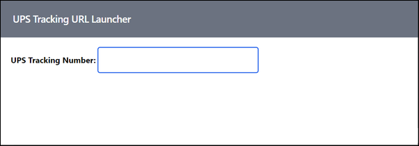

# UPS Tracking URL Launcher

You can find this app hosted at https://ups-track.netlify.app/

Have you ever been notified that a package was on its way to you, but only received the UPS tracking number instead of a link to the package delivery status page? You can take the tracking number, head over to https://ups.com and paste the tracking number in to see the current status. I get enough packages that I use a todo list manager to track incoming packages with the link to the package status so I can easily check to see when the package is due.

UPS made some changes to their online system so when you use the search feature to check the status of a package using the tracking number, the page doesn't generate a unique URL you can use to track the package in the future. With this in mind, I decided to make this app that generates the tracking URL based on the tracking number.

When you open the page, you'll see the following:

When you paste in a tracking number (the app doesn't do anything to validate the tracking number) the page displays a button you can click to open the UPS site to see the current shipment status. Copy the URL from the opened page and you have the tracking URL you need for future checks.

***

You can find information on many different topics on my [personal blog](http://www.johnwargo.com). Learn about all of my publications at [John Wargo Books](http://www.johnwargobooks.com).

If you find this code useful and feel like thanking me for providing it, please consider <a href="https://www.buymeacoffee.com/johnwargo" target="_blank">Buying Me a Coffee</a>, or making a purchase from [my Amazon Wish List](https://amzn.com/w/1WI6AAUKPT5P9).
